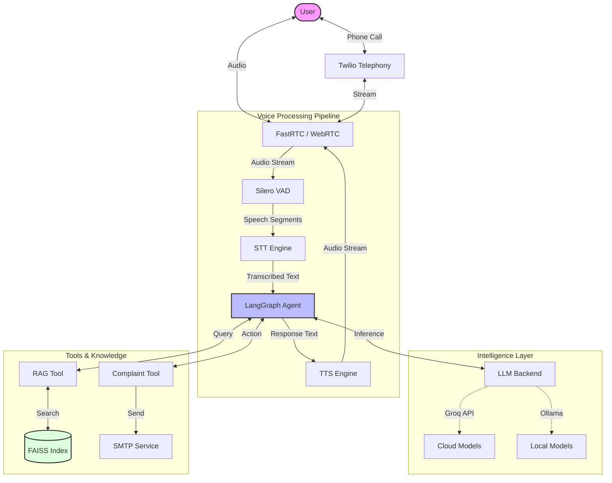
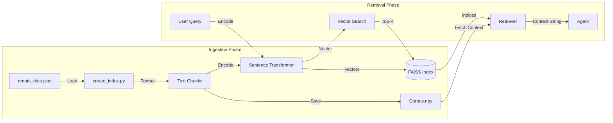
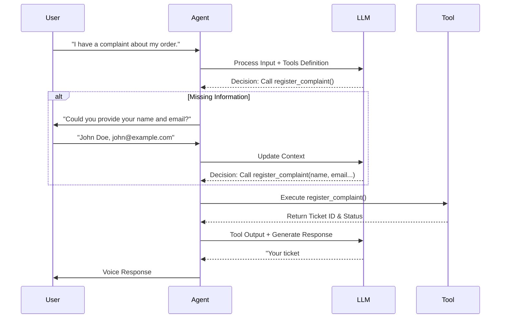

# Renata Voice AI Agent - Project Documentation

## 1. Project Description
**Renata Support Bot (Rena)** is an advanced Voice AI Agent designed to automate customer support interactions for **Renata AI** (also referred to as RenataIOT (interchangeably in the training data)). The system bridges the gap between traditional IVR systems and human support by providing a natural, conversational voice interface.

The agent is capable of:
- Understanding spoken user queries in real-time.
- Retrieving accurate, factual company information using a **RAG (Retrieval-Augmented Generation)** system.
- Handling transactional tasks such as **registering customer complaints** and sending email confirmations.
- responding with natural-sounding synthesized speech.
- Operating in both cloud-hybrid (Groq API) and fully local (Ollama/Faster-Whisper) modes.

### System Architecture

## 2. Key Features

### Voice Interaction
- **Real-time Speech-to-Text (STT):**
  - **Cloud:** Integration with Groq's Whisper API (Whisper-large-v3-turbo) for ultra-fast transcription.
  - **Local:** Fallback/Alternative support for **Faster-Whisper** (int8 quantization) running locally on CPU.
- **Text-to-Speech (TTS):**
  - **Local:** Uses **Kokoro TTS** (voice: `af_heart`) for high-quality, low-latency speech synthesis.
  - **Cloud:** Support for Groq TTS (via `process_groq_tts`).
- **Voice Activity Detection (VAD):** Utilizes **Silero VAD** to accurately detect speech start/stop and handle interruptions via `ReplyOnPause`.

### Intelligent Agent (LangGraph and LangChain)
- **ReAct Architecture:** Built using **LangGraph** to enable reasoning and tool usage.
- **Multi-LLM Support:** Flexible backend configuration supporting:
  - **Groq:** Llama 3.1-8b-instant.
  - **OpenAI/OpenRouter:** Grok (x-ai/grok-4.1-fast).
  - **Ollama:** Local Llama 3.2 or Qwen models.
- **Context Awareness:** Maintains conversation history using `InMemorySaver`.

### Tools for the Agent
#### RAG (Retrieval-Augmented Generation)
- **Knowledge Base:** Ingests structured company data (from `renata_data.json`) and converts it into text chunks.
- **Vector Search:**
  - **Embeddings:** Uses `sentence-transformers/all-MiniLM-L6-v2`.
  - **Index:** **FAISS** (Facebook AI Similarity Search) for efficient similarity retrieval.
- **Tool:** `rag_search` allows the agent to look up facts about Renata's mission, founders, and services.

#### RAG Pipeline

#### Complaint Management
- `register_complaint` tool captures user details (Name, Email, Issue).
- Generates a unique Ticket ID.
- Sends a formatted confirmation email via SMTP.

#### Tool Calling Flow

### Interfaces
- **Web UI:** Custom **Gradio** interface for browser-based testing and demos.
- **Telephony:** **Twilio** integration (via FastRTC) to handle incoming phone calls.
- **Tunneling:** **ngrok** integration to expose the local server to the public internet for phone testing.

## 3. Technologies & Approaches

| Component | Technology / Library | Approach |
|-----------|---------------------|----------|
| **Language** | Python 3.10+ | Core logic and scripting. |
| **Streaming** | `fastrtc` | Handles WebRTC audio streaming, VAD, and turn-taking logic. |
| **Web Framework** | `FastAPI`, `Uvicorn` | Serves the application and handles WebSocket connections. |
| **Agent Framework** | `LangGraph`, `LangChain` | Orchestrates the agent's reasoning loop and tool execution. |
| **LLM Backend** | `Groq SDK`, `Ollama`, `OpenAI SDK` | Provides the intelligence layer. |
| **Vector DB** | `FAISS`, `numpy` | Stores and retrieves semantic embeddings for RAG. |
| **Embeddings** | `sentence-transformers` | Converts text to vector representations. |
| **STT** | `faster-whisper`, `Groq API` | Converts audio to text (Hybrid approach). |
| **TTS** | `Kokoro`, `Groq API` | Converts text to audio (Hybrid approach). |
| **Utilities** | `loguru`, `python-dotenv`, `smtplib` | Logging, configuration, and email services. |

## 4. Progress Structure

The project is currently in a **Functional Prototype / MVP** state.

- **Core Agent Logic:** The LangGraph agent is fully implemented with the LLM and its tools (RAG and Complaint tools) (`src/company_support_agent.py`).
- **RAG Pipeline:** The data ingestion and indexing script (`src/rag_integration/create_index.py`) is complete and functional.
- **Voice Pipeline (Cloud):** `src/main.py`
    - Integrates Groq's Whisper-large-v3 for Speech-to-Text.
    - Integrates Groq's PlayAI for Text-to-Speech.
    - Integrates Groq's Llama 3.1-8b-instant for the LLM.
    - All components are written, integrated, and tested for cloud-hybrid operation.
    - Also tested extensively with OpenRouter's xAI Grok, which also functions well.
- **Voice Pipeline (Local):** `src/test_native_fastrtc.py` successfully demonstrates a fully local pipeline.
    - **Speech-to-Text (STT):**
        - Initial tests with `moonshine-base` via `fastRTC` were unsatisfactory.
        - Shifted to `Ctranslate2`'s `faster-whisper` model, which performs well.
    - **Local Large Language Model (LLM):** `Ollama` is used.
        - `Qwen3-0.6b` works well but lacks tool calling.
        - `llama3.2` offers tool calling but lacks precision.
        - `Gemma` is yet to be tested.
        - Prompt structure will be refined for accurate tool parameter calling.
    - **Text-to-Speech (TTS):** Handled by `KokoroTTS` provided by `FastRTC`.
- **Telephony Integration:** The basic structure for Twilio/Phone support is now fully configured and tested.
- **UI:** Gradio UI is working for browser-based interaction - tests how the FastAPI integration works

## 5. Expected Timeline for Completion

| Phase | Task | Status | Estimated Completion |
|-------|------|--------|----------------------|
| **Phase 1** | **Core Development** | **In Progress** | **Dec 1, 2025** |
| | Agent Logic & Tools Implementation | ✅ Done | |
| | RAG System Setup (FAISS + Embeddings) | ✅ Done | |
| | Basic Voice Streaming (FastRTC) | ✅ Done | |
| | Optimizing the prompt structure for better tool calling | 🔄 In Progress | |
| | Optimizing the RAG embeddings structure, embeddings and data quantity | 🔄 In Progress | |
| | Fine-tuning methods and GGUF conversion | 🔄 In Progress | |
| **Phase 2** | **Local Optimization** | **Done** | **Nov 30, 2025** |
| | Optimize Faster-Whisper latency (using wav instead of mp3) | ✅ Done | |
| | Fine-tune VAD thresholds | ✅ Done | |
| | Test Ollama integration for full offline capability | ✅ Done | |
| **Phase 3** | **Telephony Integration** | **In Progress** | **Dec 10, 2025** |
| | Finalize Twilio Webhook setup | ✅ Done | |
| | End-to-end phone call testing | ✅ Done | |
| | Twilio billing setup | ⏳ Pending | |
| **Phase 4** | **Deployment & Polish** | **In Progress** | **Dec 15, 2025** |
| | UV environment for the application | ✅ Done | |
| | Set up persistent database (SQLite/Postgres) | 🔄 In Progress | |
| | Final Documentation & Handover | 🔄 In Progress | |

